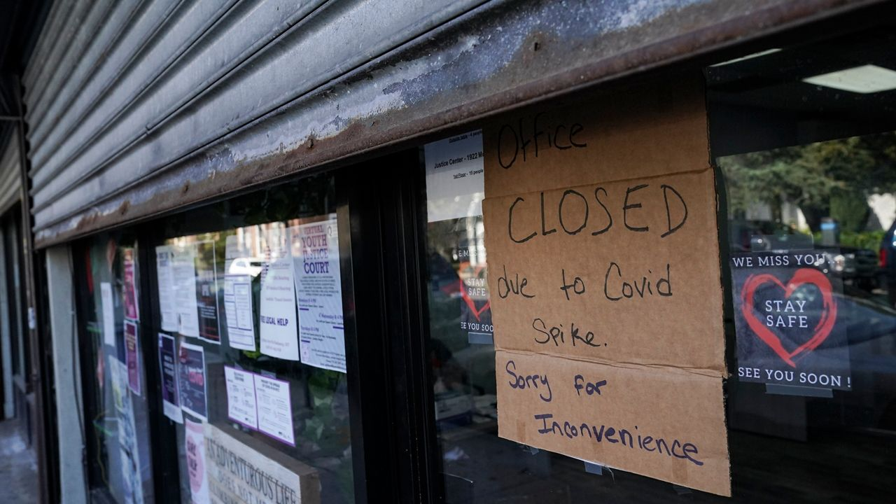

# Who Was Left Behind?

As New York City proclaimed its post-COVID recovery, the reality on the ground revealed a more complex story. While storefronts reopened and economic activity resumed in many parts of the city, countless others—especially in historically underserved communities—were left behind. Minority- and immigrant-owned businesses faced compounded barriers, from reduced access to relief funding to higher closure rates and slower rebounds.

Drawing on NYC Open Data, SBS-certified business records, and COVID-era grant distributions, this analysis traces how public policy met—or failed to meet—the needs of the city’s most vulnerable business owners. It tells a story of imbalance, missed opportunities, and the lingering scars of an unequal recovery.

---

## Policy on Paper, Gaps in Practice

In the wake of the pandemic’s economic devastation, city and federal authorities introduced a range of aid initiatives—including Paycheck Protection Program (PPP) loans, SBS emergency grants, and neighborhood support funds—to help small businesses recover. Despite billions being allocated, access to these resources was not equitable. Minority- and Women-Owned Business Enterprises (M/WBEs), in particular, encountered significant barriers in obtaining relief.  As detailed in the [the NYC Comptroller’s MWBE Recovery Report](https://comptroller.nyc.gov/reports/minority-and-women-owned-businesses-at-risk-impact-of-covid-19-on-new-york-city-firms/), structural inequalities and systemic challenges limited these businesses’ ability to benefit from federal and local recovery efforts, leaving many without the support needed to survive and rebuild.

> According to a 2020 survey by the NYC Comptroller’s Office, most M/WBEs struggled to access public aid:
>
> - **Only 6 out of 40 applicants** were approved for the City’s Business Continuity Loan.
> - **Only 15 out of 48 applicants** were approved for the Employee Retention Grant.
> - Barriers included **restrictive criteria**, **lack of outreach**, and **fear of debt**.  
> – NYC Comptroller, *July 2020*

---

## Disparity in Dollars: Who Got What?

The distribution of COVID relief money reveals further disparity. By linking SBS-certified businesses to grant disbursements by ZIP code, it becomes clear that aid per business varied significantly by race, ethnicity, and location.

<iframe src="/assets/images/aid_per_business_by_group.html" style="width: 140%; margin-left: -22%; height: 520px; border:none;"></iframe>

In the Bronx, for example, Hispanic-owned businesses received an average of $27,440 in aid—while non-minority firms in Manhattan received over $60,000. Native American and Asian-owned businesses received even less on average, despite being concentrated in areas heavily impacted by closures.

This uneven distribution suggests that eligibility on paper did not translate to access in practice. Gaps in digital infrastructure, language accessibility, and financial literacy likely deepened the divide.

---

## More Money, More Survival?

Was greater aid a lifeline? To answer that, the relationship between financial support and actual business continuity must be explored.

By analyzing license records before and after March 2020, a “retention rate” was computed for each Neighborhood Tabulation Area (NTA)—the percentage of pre-COVID businesses still active afterward. These rates were then matched with the amount of aid received and the number of certified businesses in each area.

<iframe src="/assets/images/storefront_vitality_vs_aid.html" style="width:110%; height: 600px; border:none;"></iframe>

The resulting picture is sobering. Many NTAs with significant aid still saw less than half of businesses survive. In areas like BK09 and BX05, retention hovered near 50% despite hundreds of thousands in grants. This suggests that while aid was critical, it was often insufficient on its own—particularly without parallel support in the form of technical assistance, legal help, or rent relief.

---

## A Timeline of Attrition

Beyond immediate closures, long-term survivorship paints an even starker picture. A cohort of businesses that opened before March 2020 was tracked across subsequent years, revealing borough-level trends in endurance.

<iframe src="/assets/images/survivorship_by_borough.html" style="width:132%; margin-left: -17%; height: 500px; border:none;"></iframe>

The Bronx saw over 30% of its pre-pandemic businesses close by 2025, while Queens and Manhattan fared relatively better. Staten Island and Brooklyn also suffered steady attrition over time.
This curve illustrates that recovery was not a single event, but a long, uneven climb—one that many businesses, especially in lower-income neighborhoods, could not complete.

---

## Lessons for Future Crises

Together, the visual and quantitative data point to a clear conclusion: the recovery was unequal not just in outcome, but in design. Universal programs failed to account for unequal starting points. Going forward, equitable policy must:

- 📍 **Use demographic overlays**, not just geography or income, to guide aid distribution.
- 🤝 **Leverage MWBE networks and community partners** to increase outreach and trust.
- 🌐 **Build digital and multilingual infrastructure** to ensure access across barriers.

> "Policies that support small businesses locally make neighborhoods safer, stronger, and more resilient."  
> – NYC SBS Commissioner Dynishal Gross

The pandemic tested the city's resilience—and revealed its fractures. Rebuilding requires more than reopening. It demands a recalibration of policy, practice, and purpose.

---

### Last updated: 30 April 2025  
*Created for DTU Social Data 2025 — Final Project (“The Viz & the Notebook”)*

**Authors:** Anshjyot Singh (s215806) & Victor Jules René Andrevon-Canut (s232481)

---

### Sources

- [NYC Open Data - Issued Business Licenses](https://data.cityofnewyork.us/Business/Issued-Licenses/w7w3-xahh)  
- [SBS Certified Business List](https://www.nyc.gov/html/sbs/)  
- [NYC Comptroller – MWBE Recovery Report (2020)](https://comptroller.nyc.gov/reports/minority-and-women-owned-businesses-at-risk-impact-of-covid-19-on-new-york-city-firms/)  
- [ACS Demographics – 2020](https://www.census.gov/programs-surveys/acs)  
- [Federal Reserve Bank of NY – COVID Business Impact](https://www.newyorkfed.org/)  
- [SBA PPP Distribution Data](https://data.sba.gov/)

