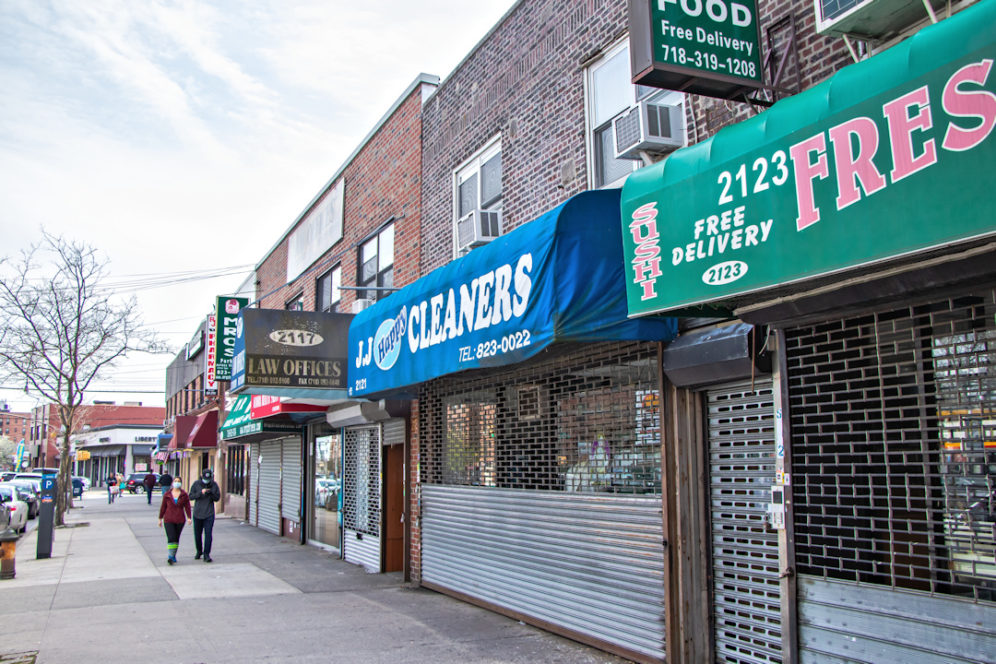
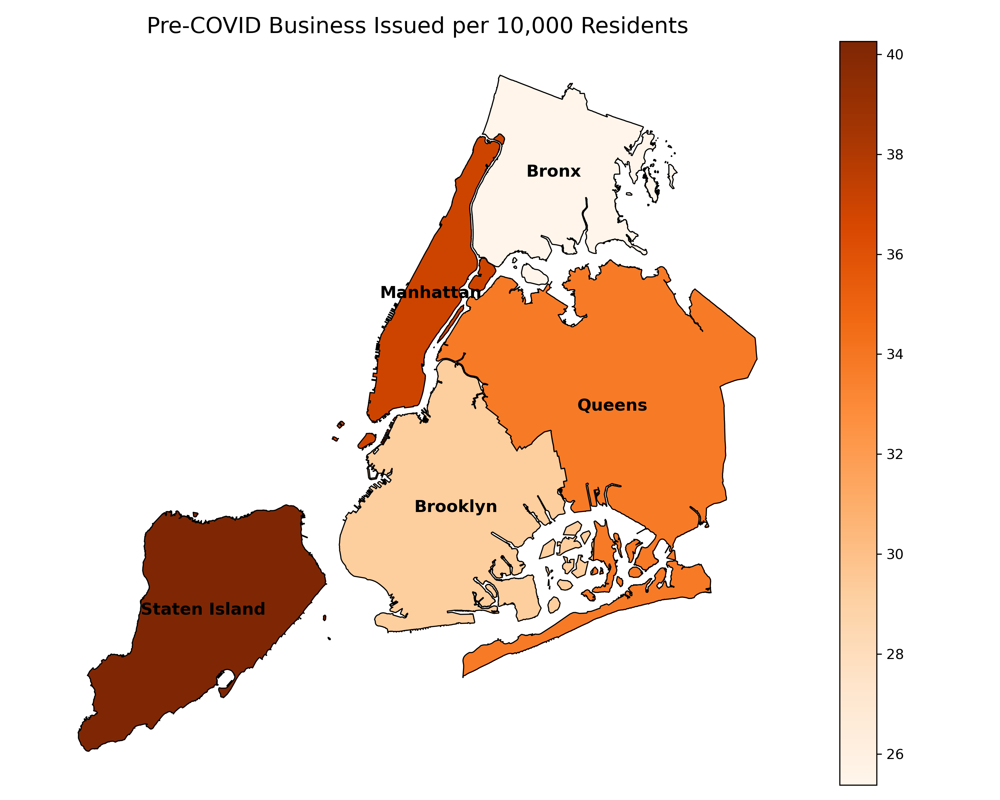
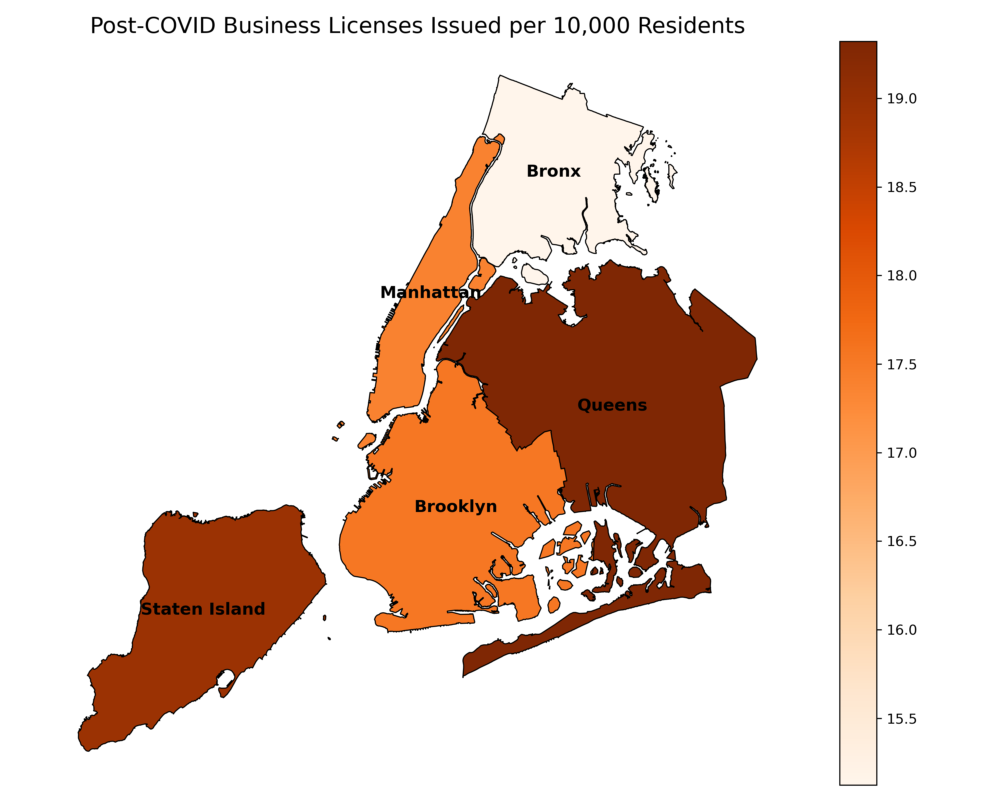

<small><em>Photo: A row of shuttered storefronts in the Bronx, 2020.</em></small>

# The Uneven Comeback

When COVID-19 shut down New York City in March 2020, the shock to small businesses was swift and severe. But as the city reopened, the comeback didn’t land evenly. While parts of Manhattan and Brooklyn sprang back with outdoor cafés and reopened boutiques, other neighborhoods—particularly in the Bronx and eastern Queens—lagged behind, with shuttered storefronts and slow business registration.

Today, that patchy recovery isn’t just visible—it’s measurable. Using [business license data from NYC Open Data](https://data.cityofnewyork.us/Business/Issued-Licenses/w7w3-xahh), we examine where recovery has taken root—and where it hasn’t—down to the neighborhood level.

---

## Borough-Level Bouncebacks: A Mixed Picture

Between 2020 and 2024, over 15,000 new business licenses were issued across New York City’s five boroughs. But where those licenses landed reveals sharp geographic disparities. While Queens and Brooklyn each added more than 4,000 new licenses post-pandemic, the Bronx barely crossed 2,000—and Staten Island issued fewer than 900. Despite its economic gravity, Manhattan experienced one of the steepest per capita declines, second only to Staten Island.

When we adjust for population, the contrasts become starker:

- Staten Island lost over 21 licenses per 10,000 residents—a 52.97% drop.
- Manhattan followed closely with a 52.98% decline, losing nearly 20 per 10,000 residents.
- The Bronx declined by 40.41%, shedding over 10 licenses per 10k residents.
 
  

This decline is made even clearer in the table below:

### License Decline by the Numbers

| Borough         | Pre-COVID Licenses | Post-COVID Licenses | % Change | Lost Licenses per 10k |
|----------------|--------------------|----------------------|----------|------------------------|
| Manhattan       | 5,830              | 2,741                | -52.98%  | -19.58                |
| Staten Island   | 1,884              | 886                  | -52.97%  | -21.33                |
| Queens          | 7,574              | 4,330                | -42.83%  | -14.48                |
| Brooklyn        | 7,319              | 4,394                | -39.96%  | -11.68                |
| Bronx           | 3,504              | 2,088                | -40.41%  | -10.26                |

---

## Neighborhood Winners and Losers: A Map of Recovery

But borough-wide averages obscure important local variation. To get a clearer view, we mapped the recovery at the Neighborhood Tabulation Area (NTA) level—revealing dramatic differences block by block - through this interactive map.

Some standout findings:

- **Sheepshead Bay–Manhattan Beach** saw a modest gain, with recovery exceeding 105%.
- **Mount Hope (Bronx)** recovered only 90.6%, and **Stuyvesant Town** saw a dramatic fall, recovering just 12.5%.
- **Dead zones** include areas like Highbridge Park—with zero net recovery.

<iframe src="/assets/images/nta_recovery_map.html" style="width:100%; margin-left:12%; height: 600px; border:none;"></iframe>

These granular differences underscore how pandemic recovery followed existing lines of inequality, mobility, and adaptation.

---

## The New Geography of Commerce

Before COVID-19, Midtown Manhattan, Lower Manhattan, and Downtown Brooklyn buzzed with dense clusters of small businesses.

**Post-pandemic**, however, the city’s commercial pulse shifted:

- **Midtown** cooled dramatically as office foot traffic vanished ([DCP 2024 Storefront Vacancy Report](https://www.nyc.gov/site/planning/about/press-releases/pr-20241115.page)).
- **Outer-borough hubs**—like Flatbush, Flushing, and corridors in the Bronx—became new centers of commercial vitality.
- Across the city, **one in three storefront businesses opened after 2020**, many in food, drink, and entertainment.

As NYC Planning Director Dan Garodnick noted, these businesses are "breathing life into local corridors" and represent “real progress in recovering vibrancy.”

> “New York isn’t just coming back—we are back," said Mayor Eric Adams.

Citywide policies—from outdoor dining expansions to zoning reforms and neighborhood grants—have played a key role in this shift. The data confirms what residents already sense: while downtowns recover unevenly, local neighborhoods are regaining momentum.

---

## One City, Two Recoveries

New York City's post-pandemic recovery has not been one story, but two.

In neighborhoods like **SoHo**, the comeback is unmistakable—driven by tourism, high-end retail, and a growing tech presence. Over the last few years, major venture firms like Andreessen Horowitz and Thrive Capital have expanded in the area, while startups and AI companies have flocked to the neighborhood in search of affordable post-pandemic office space ([NY Post, 2024](https://nypost.com/2024/06/14/tech/these-neighborhoods-are-the-epicenter-of-nycs-tech-boom/)).

> “Post pandemic, SoHo became the tech hub of Manhattan,” said Jessica Schaefer, Managing Partner at Capital V.

But just a short subway ride north tells a very different story. In **Tremont** and **Morrisania**, entire commercial corridors remain dormant. These neighborhoods—hit hard by COVID—have struggled to attract new businesses, revealing deeper structural inequalities.

This contrast illustrates a **bifurcated recovery**, where prosperity has returned unevenly—and some communities risk being left behind.

---

So what comes next?

These spatial patterns demand more than passive observation—they call for **targeted recovery interventions**. Our findings show that small business revival is not just a matter of time—it’s a matter of place.

Whether it’s **Midtown’s lingering drag** or the **resilience of East Brooklyn**, recovery strategies must be **localized**, **data-driven**, and **equity-focused**.

> “Thousands of new storefront businesses are breathing new life into our neighborhoods and bolstering the city’s economy in the process,” said B.J. Jones, Executive Director of New York’s “New” New York initiative.

City leaders agree that revitalization efforts must be grounded in smart zoning, infrastructure investment, and support for entrepreneurs in historically underserved areas. If recovery is to be citywide, policy must go neighborhood by neighborhood.

---

**Neighborhood-level patterns are only part of the story.**  
[See how citywide trends unfolded »](/trend-analysis)  
[Or explore the policies that shaped recovery »](/policy)

### Last updated: 13 May 2025 
*Created for DTU Social Data 2025 — Final Project (“The Viz & the Notebook”)*

**Authors:** Anshjyot Singh (s215806) & Victor Jules René Andrevon-Canut (s232481)

---

### Sources

- [NYC Open Data - Issued Business Licenses](https://data.cityofnewyork.us/Business/Issued-Licenses/w7w3-xahh)  
- [NYC Open Storefronts Program](https://www.nyc.gov/office-of-the-mayor/news/742-20/recovery-agenda-mayor-de-blasio-open-storefronts-program)  
- [NYC Department of City Planning Vacancy Report](https://www.nyc.gov/site/planning/about/press-releases/pr-20241115.page)  
- [SBS MWBE Recovery Report](https://comptroller.nyc.gov/reports/minority-and-women-owned-businesses-at-risk-impact-of-covid-19-on-new-york-city-firms/)  
- [Federal Reserve Bank of NY](https://www.newyorkfed.org/newsevents/news/regional_outreach/2020/20200804)  
- [NYC Economic Development Corporation](https://edc.nyc)
