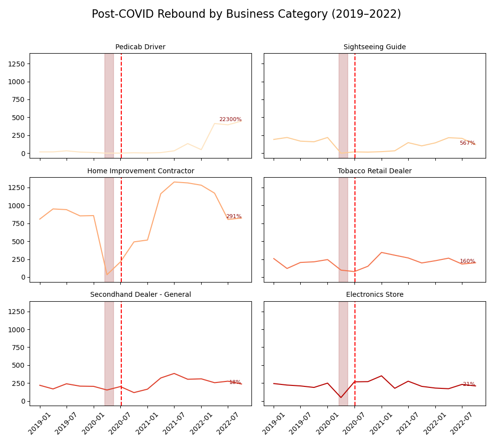

# Trend Analysis  
### NYC’s Business Licensing Trends: Harmony, Chaos and Revival

When COVID hit the Big Apple in March 2020, a city known for its non-stop business activity suddenly came to a halt. As the pandemic intensified, the local economy slowed dramatically, culminating in a citywide lockdown on March 22. But just how deep was the collapse—and how resilient was the rebound?

To find out, we analyzed every business license issued in NYC from January 2017 through April 2025, using data from the Department of Consumer and Worker Protection (DCWP) via NYC Open Data. We cross-referenced this information with pandemic timelines and city policy changes to understand how businesses navigated one of the most turbulent periods in modern history.

---

The license issuance numbers reveal a clear, multi-phased narrative that mirrors the unfolding of the pandemic itself. Two distinct phases emerge in the data: the crash and the rebound.

## The Crash: 2020’s Licensing Freefall

From 2017 to March 2020, license issuance in NYC was fairly stable, averaging between 800 and 900 new licenses per month, with expected seasonal variation. However, as COVID-19 spread and uncertainty grew, the numbers plummeted. By May 2020, only **128 licenses** were issued—down from **894 in February**. This represents an **85.7% decrease** over just three months.

As regulations and customer behavior changed rapidly, opening a new business felt too risky. Many potential entrepreneurs postponed their plans, and existing businesses struggled to remain viable.

> “As a small-business owner, I’m surprised that more businesses have not closed yet,” said Andrea Dillon, the owner of a day care in Brooklyn. ([New York Times, 2020](https://www.nytimes.com/2020/08/03/nyregion/nyc-small-businesses-closing-coronavirus.html))

Behind these figures lie real human stories: shops shuttered, dreams delayed, and livelihoods lost. The crisis exposed the vulnerabilities of street-level commerce in a global city.

---

## The Rebound: A Steady Comeback to Pre-Pandemic Life (2021–2024)

Despite the grim outlook in 2020, business licensing rebounded sharply in the years that followed. In 2021, **12,328 licenses** were issued—nearly doubling the previous year's **6,607**. Growth continued steadily into 2022 and 2023, reaching **17,236 licenses** in 2023, surpassing even the pre-pandemic peak of 2018.

By 2024, the city issued **16,157 new licenses**, signaling that while NYC had been severely impacted, its entrepreneurial spirit remained alive and adaptive. However, the rebound was not homogeneous across all sectors or license types.

---

## Premises vs. Individuals: Did the Gig Economy Take the Lead?

DCWP licenses fall into two primary categories: **"Premises"** (linked to physical storefronts or offices) and **"Individual"** (issued to people, such as freelance contractors, guides, or vendors). This breakdown offers a window into the nature of NYC’s evolving business landscape:

| Year           | Individual Licenses | Premises Licenses |
|----------------|---------------------|--------------------|
| 2017           | 1,585               | 8,392              |
| 2018           | 1,786               | 13,624             |
| 2019           | 2,104               | 8,730              |
| 2020           | 756                 | 5,851              |
| 2021           | 1,577               | 10,751             |
| 2022           | 4,470               | 10,784             |
| 2023           | 5,890               | 11,346             |
| 2024           | 5,129               | 11,028             |
| 2025 (partial) | 1,328               | 4,209              |

---

  <iframe src="/assets/images/quarterly_pct_change_covid_timeline.html" style="width:100%; height:500px; border:none;"></iframe>

While physical locations recovered steadily, **individual licenses surged at a much faster rate**. For example, during the 3rd quarter of 2020—when NYC entered reopening Phase III—individual license issuance increased by **500%**, while premises licenses rose only **100%**.

This suggests a lasting shift toward **freelance and service-based work**, particularly in sectors where mobility, flexibility, and lower overhead made survival possible. Years later, the effects are still felt.

> “[...]What may be one of the pandemic’s most unexpected economic legacies: an entrepreneurial boom.” ([The New York Times, 2024](https://www.nytimes.com/2024/10/04/business/economy/pandemic-startups-small-business-economy.html))

From tour guides and contractors to mobile vendors and remote service providers, NYC’s recovery wasn’t just about re-opening doors—it was about **re-imagining business models** altogether.

---

## What Type of Work Came Back?

The top business license categories from 2017–2025 highlight which industries drove the rebound and reshaped the city’s commercial fabric:

- **Home Improvement Contractor** – 50,401 licenses  
- **Tobacco Retail Dealer** – 18,372 licenses  
- **Secondhand Dealer - General** – 14,836 licenses  
- **Electronics Store** – 11,530 licenses  
- **Sightseeing Guide** – 10,505 licenses  

From home improvement contractors adapting to the remote work boom, to sightseeing guides riding the wave of returning tourism, each sector tells a piece of the recovery story. Retail rebounded too, as consumer habits began to stabilize by late 2021.

These categories underscore how the crisis altered both the **supply and demand side** of local commerce, pushing workers and entrepreneurs to pivot, innovate, and specialize.

---

## What This Tells Us

New York’s post-COVID business rebound isn’t just about raw numbers—it’s about **who** is launching ventures, **how** they're doing it, and **what kinds of businesses** are finding success.

- The rise of **individual licenses** reflects a deeper shift to a **freelance and gig economy**.
- Fields like **home repair, tourism, resale, and tobacco/electronics retail** led the recovery.
- Despite positive growth, thousands of businesses were lost, with lasting effects still playing out today.

In short, the city’s economy is no longer quite the same. Its skyline might be unchanged, but beneath it, the **business landscape has been reshaped** by crisis, creativity, and adaptation.

Understanding this evolution is key—not only to assessing recovery, but to **preparing for what comes next**. However, looking at city-wide trends might not tell the whole story and in a metropolis as eclectic as New York, the picture can be very different from one side of the street to the other.

---

**Citywide trends tell one story. What about the neighborhoods left behind?**  
[See the spatial breakdown »](/spatial)

**Recovery didn’t just depend on resilience—it depended on policy.**  
[See how aid was delivered »](/policy)

### Last updated: 13 May 2025  
*Created for DTU Social Data 2025 — Final Project (“The Viz & the Notebook”)*

**Authors:** Anshjyot Singh (s215806) & Victor Jules René Andrevon-Canut (s232481)

---

**Sources:**

- NYC Department of Consumer and Worker Protection, [Issued Business Licenses Dataset](https://data.cityofnewyork.us/Business/Issued-Licenses/8h5e-5nd9), extracted 2025-04-18  
- NYC Health Department COVID Timeline Archives (2020–2022)  
- [The New York Times, *One-Third of New York’s Small Businesses May Be Gone Forever*](https://www.nytimes.com/2020/08/03/nyregion/nyc-small-businesses-closing-coronavirus.html)  
- [The New York Times, *Pandemic Start-Ups Are Thriving, and Helping to Fuel the Economy*](https://www.nytimes.com/2024/10/04/business/economy/pandemic-startups-small-business-economy.html)

